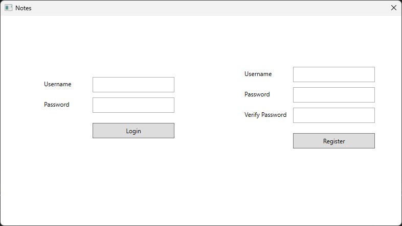
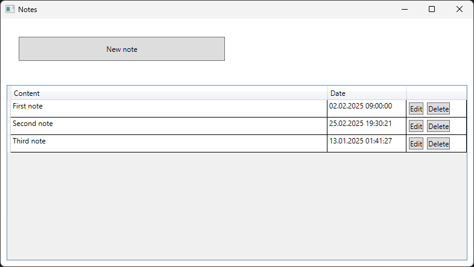
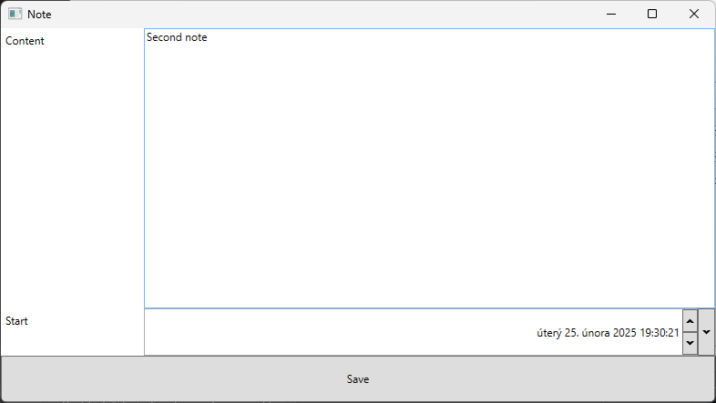

# Notes App
Simple notes app in C#. Desktop application created with WPF is communicating with the server via REST API. For server I used ASP.NET Core.

## Images

## How to run
1. Clone the repository
2. Open the solution in Visual Studio
3. Create a database
	1. Open Package Manager Console for Server project
	2. Type `Add-Migration Init` and `Update-Database`
4. Run the server and the desktop application